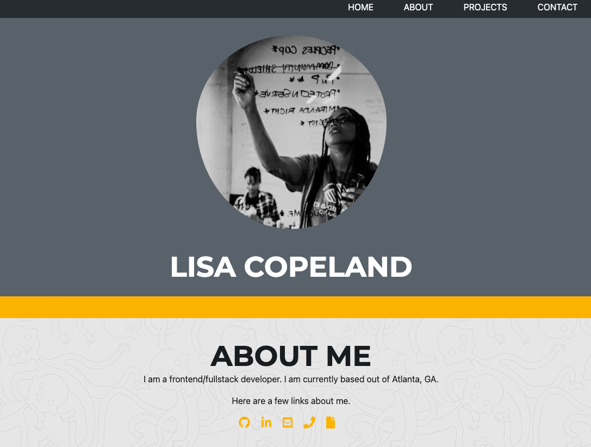

# Portfolio Version 02 🏆

## Description 
This repository is the where I develop the code my portfolio website. The HTML is valid and semantic, which improves accessibility and makes it easier to read. The code also utilizes Bootstrap CSS Framework for mobile responsiveness. Also, the images have been optimized to increase page load time. This source code is available to everyone under the standard [MIT license](LICENSE).

## Table of Contents

* [Installation](#installation)
* [Usage](#usage)
* [Credits](#credits)
* [License](#license)
* [Features](#features)
* [Contributing](#contributing)
* [Tests](#tests)
* [Badges](#badges)

## Installation
### Steps required to run locally
1. Clone/download the code in this repo
2. Navigate to the location of the code downloaded
3. Double-click on the html file provided in the downloaded code to preview
### Steps required to run online
1. Click the "VIEW SITE" link at the bottom of this README

## Usage 
This code should be used for the purpose of creating/editing code for a typical portfolio website.

## View Website
Click here to view the live website [VIEW SITE](https://stopdaydreaming.github.io/super-duper-octo-portfolio-v2/)

## Credits
1 contributor: @stopdaydreaming

## License
Copyright (c) Lisa Copeland. All rights reserved.
Licensed under the [MIT](LICENSE) license.

## Features
None at this time

## Contributing
None at this time

## Tests
None at this time

## Badges
  
  
  
  
  
  

